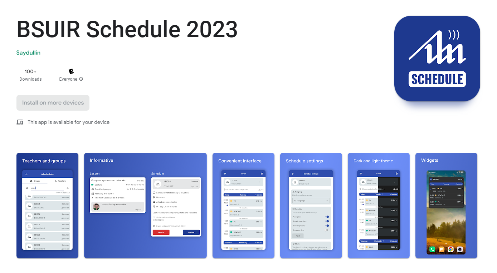

# BSUIR Schedule
<h3>Android App</h3>

Schedule of students and teachers of BSUIR University

<h4>Features:</h4>
<ul>
  <li>Teachers Schedule</li>
  <li>Students Schedule</li>
  <li>Exams Schedule</li>
  

  <li>Settings for each schedule:</li>
  <ul>
    <li>Filter by subgroup</li>
    <li>Automatically update schedule</li>
    <li>Show passed days</li>
    <li>Show empty days (no lesssons days)</li>
  </ul>
  

  <li>Full information about teachers and student groups (faculty, speciality, department, course, education type and etc)</li>
  <li>Location of students and teachers at a given time</li>
  

  <li>App settings:</li>
  <ul>
    <li>Language (Russian, English, Belorussian, Chinese)</li>
    <li>Dark/Light theme</li>
    <li>Global settings for schedule</li>
    <li>Support</li>
  </ul>
</ul>

Available on <a href="https://play.google.com/store/apps/details?id=com.bsuir.bsuirschedule">Play Market</a>
